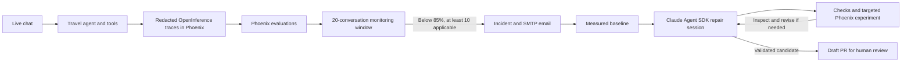

# Travel Agent Quality Lab

A travel-agent demo with Phoenix tracing, evaluations, a live dashboard, alerts, and an evidence-driven repair workflow. The deployed agent keeps serving chats while a separate Claude Agent SDK session investigates failures and proposes reviewed code changes. A PR merge does not automatically deploy or restart the running agent.

## Workflow at a glance



There are **two agent roles**: the travel agent and the repair agent. Each repair
investigation gets one SDK session; different metrics can have concurrent sessions.
Evaluation workers, LLM judges, queue consumers and SMTP delivery are supporting
services, not additional autonomous repair agents. The SDK controls investigation,
edits, validation, revisions and draft publication through constrained tools.

## Open the demo

- Chat: http://127.0.0.1:8000/
- Quality dashboard: http://127.0.0.1:8000/dashboard
- Phoenix: http://127.0.0.1:6006/
- API docs: http://127.0.0.1:8000/docs

The agent has four tools: flight lookup, hotel lookup, fixture weather, and itinerary assembly. Its static data cannot establish live availability or bookings.

## Setup

Use Python 3.13, uv and Git on PATH, with a funded Anthropic API key. Phoenix has its own environment to preserve the assessed agent's Anthropic SDK. Node.js/npm is needed only for the optional Phoenix CLI commands below; the Claude Agent SDK includes its own Claude runtime.

```powershell
uv sync --locked --extra dev --python 3.13
uv venv .phoenix-venv --python 3.13
uv pip sync --python .phoenix-venv/Scripts/python.exe requirements-phoenix.txt
```

Copy `.env.example` to `.env` only if it does not already exist. Set `ANTHROPIC_API_KEY=your_key` on one line. Both `.env` and `.env.txt` are ignored by Git; only `.env` is loaded. The spaCy redaction model is installed with the dependencies and runs locally.

```powershell
.\.venv\Scripts\python.exe -m scripts.demo start
```

Services run in the background on loopback. On Linux/macOS use the corresponding `bin/python` paths. The complete demo was exercised on Windows; CI defines isolated checks on Linux.

## Run the workflow

### 1. Enable the live feedback loop

On a fresh installation, first [audit the evaluator](#validate-the-evaluator-before-enabling-automated-proposals). Automatic proposals require a passed audit for the active evaluator version.

```powershell
.\.venv\Scripts\python.exe -m scripts.demo enable-repair
```

Use the chat UI normally. Each completed turn produces a real OpenInference trace;
Phoenix evaluators assess its final answer asynchronously. The dashboard and
monitor read current warning scores from **Phoenix span annotations**. The dashboard refreshes every
five seconds; monitoring runs on acknowledged evaluation events, without a quality-poll timer.
Workers prioritize live judgments over queued offline benchmark evaluations.
Phoenix scores are joined using the journal's exact trace/span IDs after selecting the
agent version and traffic source. Exported metadata may be redacted, so a masked version
hash cannot hide completed evaluations. Evaluator versions are still matched explicitly.

The live window holds the latest **20 conversations within 24 hours**, separated by
agent and evaluator version. After **10 applicable judgments** for any of the three primary
metrics, a rate **below 85%** opens a deduplicated incident and sends email to the
local SMTP inbox. Recovery requires **95%**. Unknown/pending/not-applicable results
never count as passes. Only conversations submitted through the chat API enter this
window; offline benchmarks are excluded. Operator-generated test messages sent to
that same API also exercise the live pipeline.

The **Live** tab defaults to recorded performance, preserving the last 20 conversations
for each agent/evaluator version without a 24-hour display cutoff. **Performance view**
selects a saved version or the current warning window; **Performance by version** compares
previous versions and links to their traces. Previous evaluator judgments remain inspectable.
Historical scores are labeled as recorded evidence; they do not trigger fresh alerts.
All live turns remain in trace history, including turns outside the 20-conversation summary.

**PRs & escalations → Email delivery** shows actual queued, sending, retrying, failed,
received and SMTP-accepted events. Each escalation also links directly to its email receipt.
“Email sent” requires a successful SMTP receipt; the local demo inbox is explicitly labeled
and does not prove delivery to an external mailbox.

Live history, judgments and email evidence live in the durable quality journal, outside Git.
Local restarts and Git commits/merges retain `.quality/quality.sqlite3` and `.quality/phoenix/`.
For replacement checkouts, keep `QUALITY_STATE_DIR` pointing at the same persistent directory;
back it up along with Phoenix storage. Kubernetes uses the configured external PostgreSQL
journal and persistent artifact storage; changing images must retain those services/volumes.

### 2. A live flag starts the repair workflow

1. Preserve the flagged real conversations and trace IDs as diagnosis evidence.
2. Measure a current-agent reference baseline if a compatible one is unavailable.
3. Start one Claude Agent SDK repair session: load relevant official Arize/Phoenix
   skills, inspect actual Phoenix evidence, and stage a minimal fix from the
   sanitized **live failures**.
4. That session calls fixed checks and up to 15 targeted Phoenix development
   scenarios, inspects results, and revises when warranted (three candidates max).
   Held-out cases stay out of diagnosis; completed experiments survive restarts.
5. The SDK calls a gated tool to open/update a draft PR. Full evaluation follows the daily
   checkpoint policy or a manual request. Human review controls merge and deployment.

The 60 reference scenarios are regression tests, **not the live monitoring feed**.
Full benchmarks run for the initial baseline, scheduled checkpoints and explicit
operator requests. They make real provider calls.
A frozen baseline always precedes patch generation. One active investigation per
metric groups repeated flags until its PR is reviewed. Two repair workers can
investigate different metrics concurrently, sharing a compatible measured baseline.
Each produces separate artifacts and a draft PR. Closing or merging a PR releases
its metric lock after GitHub state is confirmed.

A benchmark manifest records source, fixture, dataset, redactor and evaluator
hashes, models, repetitions and Phoenix experiment IDs. Its original evidence is
sealed; changing a judge does not rewrite history.

The repair model cannot edit evaluators, thresholds, reference data, dependencies,
or credentials. GitHub credentials use the existing credential helper or
`GITHUB_TOKEN`/`GH_TOKEN`. Failed publication preserves the patch locally.

The repair runtime uses Phoenix evaluation/tracing skills and Arize prompt
optimization/experiment skills, with native SDK skill loading and Phoenix MCP
tools. Each session has its own workspace and budget and calls validation and draft
publication tools itself. Workers retain durable delivery and per-metric locks.
[Runtime architecture and skill rationale](docs/repair-runtime.md).

### 3. Inspect and calibrate

The dashboard opens on **Live**, with **Benchmarks** as the other metric view.
Trace history defaults to live conversations. Inspect a request for its final answer,
judgments, preserved prior judgments and separate tool diagnostics. Human labels calibrate judges;
they are stored as separate `human_*` Phoenix annotations and do not overwrite LLM
labels, rolling scores or immutable benchmark results. Metric/label filters apply
before trace pagination; inspecting a historical version shows that version's judgment.

**Inspect → Trace call tree** reads the real Phoenix spans. Expand an agent, LLM,
or tool call to see its redacted inputs/outputs, parent span, duration, execution
status, model and recorded token counts. A tool exception retains the input and
error type without exporting its private exception message. Execution `OK` means
the call completed; quality failures remain in evaluations/tool diagnostics.

**Recent version updates** shows the loaded agent fingerprint, evaluator revisions,
and proposed candidate changes with PR links and review status. Times are observed
execution/startup times, not invented deployment dates. Unchanged restarts do not
create releases. Candidate experiments never mark a patch as deployed. New serving
code is recorded when the API loads it; editing files alone displays a restart notice.

**Email delivery evidence** shows actual SMTP inbox receipts for
`travel-agent-dev@example.com`: recipient, queued/accepted/received times, subject,
message body, Message-ID and
the sender's recorded SMTP response. A `250` acceptance plus a matching inbox row
proves local delivery. It does not prove delivery to an external team mailbox.
Older receipts remain visible without inventing missing sender responses.
Configure `QUALITY_SMTP_*` for an external relay; relay acceptance alone is not
proof of final external inbox delivery.

### Exercise the live dashboard

```powershell
$conversationId = [guid]::NewGuid().ToString()
$body = @{
    conversation_id = $conversationId
    message = 'Compare New York to Los Angeles flights for October 3, 2026. Include flight numbers and prices.'
} | ConvertTo-Json
Invoke-RestMethod -Method Post -Uri http://127.0.0.1:8000/chat -ContentType application/json -Body $body
```

Use the chat UI or `POST /chat` for demonstrations. Reuse the conversation ID for
follow-up messages; create a new UUID for each new conversation. Each request runs
the actual agent, tools, tracing, evaluation and rolling-window monitoring pipeline.
Wait for evaluations to finish when checking metrics. Include factual lookup
questions to exercise groundedness; responses without checkable claims can be
not applicable and do not satisfy its 10-sample minimum.

There is no separate demo-scenario dashboard view. Earlier development-stream
records retain their original provenance and remain accessible through **All
executions** in trace history, labeled **Archived simulation**. They are not
retroactively counted as live chats. Reference benchmark traffic also stays separate.

### Hosted tracing

`ARIZE_SPACE_ID`, `ARIZE_API_KEY`, and `ARIZE_OTLP_ENDPOINT` in the ignored `.env`
enable a redacted OTLP mirror to Arize AX. `/v1` is normalized to the HTTP
`/v1/traces` endpoint. The key is never included in traces or job payloads.
Phoenix remains the OSS workbench for evaluations, annotations and experiments;
Arize AX is the authenticated hosted tracing destination. Their credentials are
not interchangeable. Local Phoenix does not require a key with authentication
disabled. `/quality/state` exposes recorded collector delivery and readback status;
the simplified dashboard focuses on quality metrics, escalations and traces.

### Operations

```powershell
.\.venv\Scripts\python.exe -m scripts.demo status
.\.venv\Scripts\python.exe -m scripts.demo retry-failed
.\.venv\Scripts\python.exe -m scripts.demo resume-repair
.\.venv\Scripts\python.exe -m scripts.demo revise-repair
.\.venv\Scripts\python.exe -m scripts.demo sync-prs
.\.venv\Scripts\python.exe -m scripts.report
.\.venv\Scripts\python.exe -m scripts.demo stop
```

Retries reuse validated candidates and completed cases. A hard-check rejection is
terminal for that candidate. `revise-repair` starts a distinct development revision.
Full checkpoint regressions can trigger further revisions, capped at three proposals
per chain. It does not resample an unchanged candidate until it passes. Model calls
and SMTP are at-least-once operations. Leases and idempotency keys reduce duplicates;
the local inbox deduplicates Message-ID.

The launcher starts a controller/evaluator process and two independent repair
processes. The Kubernetes profile uses two repair pods and PostgreSQL push wakeups.
To automate PR lifecycle updates outside loopback, configure a signed GitHub
`pull_request` webhook at `/quality/github/webhook` and `QUALITY_GITHUB_WEBHOOK_SECRET`.
The local `sync-prs` command confirms actual GitHub state without exposing this app.
Without an incoming webhook or an explicit sync, a local PR record can retain its
previous status even after the GitHub PR has been merged.
An explicit `python -m scripts.demo review-failures --metric groundedness --run-id RUN_ID`
can investigate a recorded current failure when the rolling window is healthy.
It uses the same baseline, metric lock and PR gates. The dashboard labels this as
an operator-requested review; it does not invent a threshold breach or send a threshold email.

**If a response stays pending:** evaluations are asynchronous and make separate
judge calls, so the chat can finish before its labels appear. Check the dashboard's
provider/worker status, `/quality/state` and `.quality/worker.log`. A saved provider
credit pause requires [explicit resumption](#resume-after-a-provider-credit-interruption)
after credits are restored. Pending/unknown results are excluded from pass rates.
The current warning window requires acknowledged Phoenix annotations; recorded
history can show a completed local judgment before its export finishes. Previously
redacted version metadata no longer prevents existing Phoenix scores from being read.

After pulling merged agent code, restart the local services with `scripts.demo stop`
and `scripts.demo start` using the Python invocation above. The same state directory
retains traces, evaluations, email receipts and versions. In-flight jobs may resume
after their leases expire. Existing scheduling and retry rules still apply; a
restart does not erase or replace recorded evidence.

## Evaluation policy

| Metric | What it measures |
|---|---|
| Correctness | Current trip constraints, direction, dates, duration, budget, multi-turn changes |
| Groundedness | Factual support from independent fixture evidence and known data limitations |
| Topic relevance | Travel-domain behavior, evaluated separately from factual accuracy |
| Completion diagnostic | Retained in trace details; excluded from new alerts and checkpoint decisions |

The three primary rubrics are customer-defined Phoenix `ClassificationEvaluator`
instances using an Anthropic LLM judge. Programmatic checks validate tool contracts
and explicit itinerary day coverage; a failed day-coverage check can determine
correctness/completion without a judge call. Independent fixture references ground
the assessment. A handled tool error need not fail the final response.

Every completed assistant turn is evaluated with the conversation context available
at that point. There is no separate whole-conversation reviewer. The rolling window
uses each conversation's latest response; earlier turn scores remain inspectable.
Pass rate is `pass / (pass + fail)`. Pending, unknown and not-applicable labels stay
visible and are excluded from that denominator. Completion remains a diagnostic.

Alerts use the live-window policy above. Benchmark and validation traffic cannot open live quality incidents. Agent and evaluator versions stay separate. Redaction failure withholds content and queues an immediate incident. Threshold breaches are operational signals, not statistical proof of population drift.

Reference scenarios and judges await human calibration. Repeated executions are correlated; confidence intervals do not account for judge error.

## Privacy and execution boundaries

Local redaction precedes feedback persistence and telemetry export. Covered entities include names, emails, phones, street addresses, passport-like IDs, payment identifiers, and common secret formats. Provider exceptions retain their type instead of raw messages. Tests check detection and preservation of travel constraints.

Raw chat context remains in process memory; conversations have idle expiry and capacity limits. The original agent's provider request still contains what the user submits. Redaction protects the feedback loop and judge/repair context.

Local recognizers can miss unusual personal data or over-redact. Production needs broader adversarial coverage, reviewed policy, authentication, encryption, and retention enforcement. Candidate syntax restrictions and subprocess timeouts are a local demo boundary, not a production VM sandbox. Keep the unauthenticated demo on loopback.

## Checks and documentation

### Optional Kubernetes deployment

The local demo remains unchanged. A container, shared PostgreSQL journal, separate
evaluation workers/controller, and optional KEDA queue autoscaling are now provided.
See [deployment setup and enterprise capacity limits](docs/deployment.md). A cluster
is not required to use this demo; no million-request throughput is claimed.

```powershell
uv run pytest -q
uv run ruff check agent quality tests scripts
uv pip check
```

Unit tests use temporary databases and do not export test fixtures as telemetry.
CI needs no LLM credentials and checks the PostgreSQL backend, Kubernetes manifests
and container as well as the Python suite. Paid benchmarks run for a required
baseline, eligible scheduled checkpoint or explicit operator request; candidate
development experiments also use real provider calls.

- [Architecture and workflow](docs/architecture.md)
- [Historical measured results](docs/demo-results.md)
- [Metric definitions](docs/metrics.md)
- [Assessment requirements and skills usage](docs/requirements.md)

Core infrastructure lives in `quality/`. Travel policy and independent references live in `quality/profiles/travel.py`. Another agent needs its capture adapter, evidence source, rubrics, and scenarios; storage, workers, monitoring, and experiment gates can be reused.

## Phoenix tooling

The official [tracing skill](.agents/skills/phoenix-tracing/SKILL.md), [evaluation skill](.agents/skills/phoenix-evals/SKILL.md), and [CLI skill](.agents/skills/phoenix-cli/SKILL.md) informed the implementation. Relevant references are retained locally. OpenInference supplies AI span semantics and instrumentation using OpenTelemetry SDK/OTLP underneath.

The Phoenix CLI was used to inspect actual projects and traces:

```powershell
$env:PHOENIX_ENDPOINT='http://127.0.0.1:6006'
$env:PHOENIX_PROJECT='travel-agent'
npx --yes @arizeai/phoenix-cli@1.18.2 trace list --limit 2 --format raw --no-progress
```

Phoenix stores native datasets, experiments, runs, and annotations. The demo dashboard adds incident, repair, and delivered-email views.

### Validate the evaluator before enabling automated proposals

With Phoenix and the worker running, execute:

```powershell
.venv\Scripts\python.exe -m quality.audit_evaluator
.venv\Scripts\python.exe -m scripts.demo enable-repair
```

The audit runs the actual judge against 17 preserved, redacted real responses in
`datasets/evaluator-recorded-responses.json`, with 60 developer-authored expected
labels. It creates real evaluation traces and a Phoenix experiment. Archived
responses are evidence inputs; they are never inserted as new live conversations
or replayed as new agent telemetry. A passed audit for the active evaluator is
required before automatic proposals. Customer human calibration remains pending.

### Resume after a provider credit interruption

Restore Anthropic credits first, then run:

```powershell
.venv\Scripts\python.exe -m scripts.demo resume-provider
```

This resumes the recorded blocked campaign, retries its unfinished evaluation jobs
and incident workflow, and retains successful cases, judgments and original failures.
It does not rerun rejected candidates to seek better scores. Unfinished multi-turn
cases can require a new real conversation; every attempt remains distinguishable.

## Verified runs — September 16, 2026

The latest live exercise sent **20 independent conversations through `POST /chat`**:
nine flight questions, seven hotel questions, two weather questions, one general
travel question and one off-topic request. All answers, tool calls, traces and
judgments came from actual executions; no result or telemetry was synthesized.
Agent version: `a56d94e4`; evaluator version: `1c8682c6`.

| Primary metric | Observed result |
| --- | --- |
| Correctness | 19/20 passed — 95.0% |
| Groundedness | 17/18 applicable passed — 94.4%; two not applicable |
| Topic relevance | 20/20 passed — 100.0% |

All 20 evaluations reached Phoenix and monitoring, with zero pending judgments.
One response incorrectly calculated `3 × $142` as `$436`; correctness and groundedness
both flagged it. No new threshold escalation was warranted. This is a small,
operator-generated live exercise, not a population accuracy or improvement claim.

The pending-score investigation also fixed a real read-path defect: PII redaction
had masked version metadata used by the Phoenix query. Exact trace/span identity
now retrieves the existing annotations while retaining source/version isolation.
The local suite passed **168 tests**, with seven PostgreSQL tests reserved for CI.

PRs [#3](https://github.com/brianlu2001/sample-travel-agent/pull/3) and
[#4](https://github.com/brianlu2001/sample-travel-agent/pull/4) are merged. The previously
credit-blocked full checkpoint `0aecd48209aa4c2c83de55c674d6c137` has resumed and completed,
with 120 final scenario outcomes and a sealed version record. Completion alone does
not constitute human approval or proof of improvement; inspect its saved result in
**Benchmarks**. The 20-chat exercise did not trigger a new SDK repair, so it does not
establish a fresh end-to-end verification of the unified SDK-owned repair loop.

Historical evidence is preserved in [the PR #2 end-to-end run](docs/demo-verified.md),
[event-driven repair verification](docs/event-workflow-verified.md), and
[the operator-triggered SDK PR #3 replay](docs/sdk-pr3-replay.md). These are dated
reports: their original draft-PR or credit-blocked status descriptions are historical.

### Manual full evaluation and saved baselines

Open **Dashboard → Benchmarks → Run full evaluation** to queue a full run for the
selected target. The target version is displayed beside the button;
unmerged PR code must be selected explicitly. Completed runs have immutable
version records available through **Saved version**, including historical baselines.
New manual checkpoints compare with the original compatible baseline and preserve it.

Select the running agent or a registered candidate in the **Evaluate** selector.
The saved-experiment selector is for viewing history, independently of the run target.

See [evaluation cadence](docs/evaluation-cadence.md) for the active policy. Candidate
revisions get targeted checks; full checkpoints run after 24 hours AND an unmeasured
version change. To enable this schedule on a fresh installation:

```powershell
.venv\Scripts\python.exe -m scripts.demo enable-checkpoints
```

Keep `scripts.demo start` running for the local worker to execute scheduled work.
Full checkpoints require human approval before release. The dashboard records this
approval; it never merges or deploys agent code. PR #2 retains its original measured
results and historical acceptance policy.
