# Proof-of-concept architecture

```mermaid
flowchart LR
    U[User chat] --> A
    S[Automated development scenarios] --> A
    A[Chat agent + OpenInference] -->|Redact real traces| P[Phoenix OSS]
    A -->|Same redacted traces| X[Arize AX]
    P --> W[One feedback worker]
    W -->|Evaluate each real turn| P
    P -->|Separate user/scenario windows + annotations| W
    W -->|Below threshold| F[Email + repair investigation]
    F --> E[Invariants + targeted Phoenix experiment]
    E -->|Hard checks pass| R[Draft PR]
    R --> D[24h + new version / manual checkpoint]
    D --> C[Full Phoenix experiment + baseline comparisons]
    C -->|Confirmed regression| F
    C --> H[Human approval → merge / deploy]
```

## Four responsibilities

1. **Agent:** the existing travel chatbot and its four tools. A thin wrapper captures
   actual agent, LLM and tool spans using OpenInference. Local redaction runs before
   any feedback persistence/export. The active agent does not adopt patches automatically.
2. **Phoenix:** the OSS workbench for traces, per-span evaluations, human review,
   reference datasets and before/after experiments. The live monitor reads scores
   from Phoenix annotations. Arize AX also receives the same redacted real traces
   using the supplied credentials; it is a separate hosted destination.
3. **One feedback worker:** evaluates each completed chat, attaches results to Phoenix,
   checks the rolling window every five seconds, and handles alerts and a bounded
   repair investigation. It checks daily checkpoint eligibility every 30 seconds.
   A small SQLite journal provides retries and incident
   deduplication. The optional [Kubernetes profile](deployment.md) moves the journal
   to PostgreSQL and separates evaluation replicas from a singleton controller.
   The running local demo remains on SQLite; no cluster is deployed.
4. **Demo UI:** chat, live metric cards, real incidents and repair status. Phoenix
   provides detailed trace/experiment inspection. The local SMTP inbox demonstrates
   actual email delivery without requiring a real development-team mailbox.

The automated scenario stream is one lane of the existing worker. It uses real
agent/model/tool calls on synthetic development inputs and tags them `scenario`.
Phoenix keeps this traffic separate from `live` user chats and `benchmark`
validation. Both online sources use the same monitoring rules. The runner pauses
requests on an incident, follows the before/after workflow, and stops at a new PR
or a terminal rejection/failure. This adds no service or orchestration platform.

Email evidence consists of the SMTP server's recorded acceptance response and its
matching Message-ID in the local inbox. The UI reports local receipt explicitly;
no external email delivery is claimed.

## Continuous workflow

1. A real user sends a message; its turn is captured and redacted.
2. Phoenix evaluators independently judge correctness, groundedness, relevance and
   task completion. Tool diagnostics remain separate from final-answer quality.
3. Once annotations arrive in Phoenix, the monitor updates the latest **20 conversations
   within 24 hours**, for the current agent and evaluator version.
4. After **10 applicable labels** for any of the three primary metrics, **below 85%** creates an
   incident and email immediately. At least **95%** resolves it. Unknown, pending
   and not-applicable labels are excluded from pass-rate denominators and shown.
5. A live flag starts a repair investigation using the failing real conversations.
   Repeated metric flags for the same agent/evaluator revision share one investigation.
6. If no compatible reference baseline exists, the worker measures it **before
   proposing any agent improvement**. The 60-case reference set is for validation;
   its traffic never enters the live monitoring window or opens live quality alerts.
7. The repair agent proposes a bounded prompt/tool patch, runs invariant checks,
   and executes up to 15 development scenarios. Held-out cases remain outside
   patch-generation context. Hard checks permit a draft PR with full evaluation pending.
8. The same worker runs a full checkpoint after 24 hours AND an unmeasured version,
   or on manual request. It compares with the original and last approved baselines.
   Confirmed regressions raise incidents and bounded follow-up proposals. A person
   reviews the exact tested version, merges and deploys.
   The next agent revision starts its own live quality window. No automatic rollout.

## Reuse without building a platform

The reusable parts are OpenInference capture, Phoenix evaluation/annotation APIs,
rolling-window monitoring, alerts and worker retries. To adapt another agent, supply
its invocation adapter, domain rubrics, authoritative evidence and regression cases.
The travel-specific policy is in `quality/profiles/travel.py`; patch validation in
`quality/remediation.py` and `quality/validation.py` is intentionally specific to
this repository and must be replaced for a different repository.

The running demo is a single-machine proof of concept. The repository also includes
a container and PostgreSQL/Kubernetes deployment profile for evaluation replicas.
It is not a tested multi-tenant platform: scaling chat sessions, exports and
monitoring, calibrating judges and isolating candidate execution remain production
work. See [deployment.md](deployment.md) for implemented mechanisms and limits.

See [verified end-to-end results](demo-verified.md) for the completed baseline, rejected candidate, validated revision, SMTP receipt and draft PR.

## Evidence and current limits

- PR #1 was closed unmerged because it depended on the previous evaluator.
- The current evaluator passed 60 regression expectations across 17 actual recorded
  responses. The rubrics are custom travel definitions executed by Phoenix, not
  claimed to be stock Arize metrics. Human calibration is still pending.
- A fresh campaign ran 10 conversations (11 turns). Its Phoenix window measured
  correctness at 6/10, below the configured 85% threshold, opening incident
  `386827bfec4c4e0d85277c5d887fcf33` automatically.
- The local SMTP server accepted and received Message-ID
  `<8bfc3f92f52e5786a296622e9591279c@quality.local>` with response
  `250 Message accepted for local delivery`. This is local receipt, not external delivery.
- Baseline `0bdadd2dd8ab477eac11264ea398cefd` was sealed before proposal work began.
  It contains 120 final scenario outcomes. Failed provider requests during a credit
  outage remain in history; unfinished cases were resumed after credits were restored.
- The original agent stays unchanged until a person reviews, merges and deploys
  a validated proposal. Candidate execution uses a separate constrained environment.
- Completion estimates useful output; it does not measure bookings, revenue or satisfaction.
  This remains a local POC, with customer human calibration and production hardening deferred.

See [metrics](metrics.md), [evaluator audit](evaluator-audit.md) and
[assessment requirements](requirements.md) for the definitions, business rationale,
and actual skills/CLI usage. Presentation and the formal specification remain deferred.
