# Proof-of-concept architecture

See [event-workflow verification](event-workflow-verified.md) for the current
observed trigger, SMTP receipt, parallel repair reservations and provider pause.

```mermaid
flowchart LR
    U[Chat UI or POST /chat] --> A
    A[Chat agent + OpenInference] -->|Redact real traces| P[Phoenix OSS]
    A -->|Same redacted traces| X[Arize AX]
    P --> W[Evaluation workers]
    W -->|Evaluate each real turn| P
    W -->|Phoenix acknowledges annotations| M[Durable evaluation event → monitor]
    P -->|Live conversation window + annotations| M
    M -->|Below threshold| F[Incident + email + per-metric lock]
    F --> B[Shared frozen baseline]
    B --> R1[Repair worker 1]
    B --> R2[Repair worker 2]
    R1 --> E[Separate candidates: invariants + targeted Phoenix experiments]
    R2 --> E
    E -->|Hard checks pass| R[Draft PR]
    R --> D[24h + new version / manual checkpoint]
    D --> C[Full Phoenix experiment + baseline comparisons]
    C -->|Confirmed regression| F
    C --> H[Human approval → merge / deploy]
    H -->|Verified PR close/merge event| L[Release that metric lock]
```

## Four responsibilities

1. **Agent:** the existing travel chatbot and its four tools. A thin wrapper captures
   actual agent, LLM and tool spans using OpenInference. Local redaction runs before
   any feedback persistence/export. The active agent does not adopt patches automatically.
2. **Phoenix:** the OSS workbench for traces, per-span evaluations, human review,
   reference datasets and before/after experiments. The live monitor reads scores
   from Phoenix annotations. Arize AX also receives the same redacted real traces
   using the supplied credentials; it is a separate hosted destination.
3. **Feedback workers:** evaluate completed turns and attach results to Phoenix.
   Each acknowledged evaluation emits a durable monitoring event. The controller
   evaluates the window on this event, then atomically reserves one investigation
   for each breached metric. Two independent repair processes can work on different
   metrics, with separate artifacts and draft PRs. The metric stays locked through
   human review. Daily checkpoint eligibility is still checked every 30 seconds.
   Local SQLite provides durable jobs; the [Kubernetes profile](deployment.md) uses
   PostgreSQL push notifications, evaluator replicas and two repair containers.
   The running local demo uses processes; no cluster is deployed.
4. **Demo UI:** chat, live metric cards, real incidents and repair status. Phoenix
   provides detailed trace/experiment inspection. The local SMTP inbox demonstrates
   actual email delivery without requiring a real development-team mailbox.

The demonstration uses the ordinary chat UI or `POST /chat`. Operator-generated
messages go through this same endpoint and appear in **Live**, with actual agent
responses, tool calls, traces and judgments. Offline `benchmark` validation remains
separate. Earlier development-stream records retain their `scenario` provenance
in history as **Archived simulation**; they are not relabeled or included in Live.
The dashboard has two metric views: **Live** and **Benchmarks**.

Email evidence consists of the SMTP server's recorded acceptance response and its
matching Message-ID in the local inbox. The UI reports local receipt explicitly;
no external email delivery is claimed.

## Continuous workflow

1. A real user sends a message; its turn is captured and redacted.
2. Phoenix evaluators independently judge correctness, groundedness, relevance and
   task completion. Tool diagnostics remain separate from final-answer quality.
3. Once annotations arrive in Phoenix, the monitor updates the latest **20 conversations
   within 24 hours**, for the current agent and evaluator version.
4. After **10 applicable labels** for any of the three primary metrics, **below 85%** creates an
   incident and email immediately. At least **95%** resolves it. Unknown, pending
   and not-applicable labels are excluded from pass-rate denominators and shown.
5. A live flag starts a repair investigation using the failing real conversations.
   Repeated flags for that metric share its active investigation, even across
   agent/evaluator revisions. Other metrics can start independent investigations.
6. If no compatible reference baseline exists, the worker measures it **before
   proposing any agent improvement**. The 60-case reference set is for validation;
   its traffic never enters the live monitoring window or opens live quality alerts.
   Concurrent repairs share one compatible baseline, including one already started
   by a scheduled/manual evaluation. Baseline completion wakes waiting repairs.
7. The repair agent proposes a bounded prompt/tool patch, runs invariant checks,
   and executes up to 15 development scenarios. Held-out cases remain outside
   patch-generation context. Hard checks permit a draft PR with full evaluation pending.
8. The controller runs a full checkpoint after 24 hours AND an unmeasured version,
   or on manual request. It compares with the original and last approved baselines.
   Confirmed regressions raise incidents and bounded follow-up proposals. A person
   reviews the exact tested version, merges and deploys.
   The next agent revision starts its own live quality window. No automatic rollout.

### Delivery and review lifecycle

There is no five-second quality-check timer. The dashboard refreshes every five
seconds, independently of escalation. After Phoenix acknowledges annotations,
the journal stores an idempotent monitoring event with the actual Phoenix window
snapshot. A monitor backlog therefore cannot erase a brief observed breach by
substituting a later recovered window. PostgreSQL `LISTEN/NOTIFY`
wakes consumers after commit; jobs, leases and retries provide recovery if a
notification is missed. SQLite uses short queue polling locally, which does not
recompute quality. A queue recovery timeout remains necessary after worker failure.

An atomic unique index allows only one active request per project/source/metric.
Its states are queued → waiting for baseline → running → awaiting review. Recovery
and a second breach preserve the active repair's evidence and suppress another
opening alert. A signed GitHub `pull_request.closed` webhook triggers an API check
of the PR's actual state before releasing the lock. For the loopback demo,
`python -m scripts.demo sync-prs` performs that same confirmation explicitly.
Rejected/failed attempts remain visible and do not restart on every new sample;
operational failures can be retried explicitly. Publication problems retain the lock.
Checkpoint-triggered repairs also acquire these locks. A measured revision may
update its own existing PR under the accepted daily policy; it cannot create a
competing repair for a metric that is already awaiting review.

Concurrent PRs can touch the same prompt or tool. They remain separate proposals;
after merging one, rebase and validate the other against the new baseline before
approval. The infrastructure does not automatically combine or deploy them.

There are two agent roles: the user-facing travel agent and the repair agent.
Two repair workers are concurrent instances of the latter. Evaluator workers and
LLM judges score responses; they are not additional autonomous agents.

## Reuse without building a platform

The reusable parts are OpenInference capture, Phoenix evaluation/annotation APIs,
rolling-window monitoring, alerts and worker retries. To adapt another agent, supply
its invocation adapter, domain rubrics, authoritative evidence and regression cases.
The travel-specific policy is in `quality/profiles/travel.py`; patch validation in
`quality/remediation.py` and `quality/validation.py` is intentionally specific to
this repository and must be replaced for a different repository.

The running demo is a single-machine proof of concept. The repository also includes
a container and PostgreSQL/Kubernetes deployment profile for evaluation replicas.
It is not a tested multi-tenant platform: scaling chat sessions, exports and
monitoring, calibrating judges and isolating candidate execution remain production
work. See [deployment.md](deployment.md) for implemented mechanisms and limits.

See [verified end-to-end results](demo-verified.md) for the completed baseline, rejected candidate, validated revision, SMTP receipt and draft PR.

## Evidence and current limits

- PR #1 was closed unmerged because it depended on the previous evaluator.
- The current evaluator passed 60 regression expectations across 17 actual recorded
  responses. The rubrics are custom travel definitions executed by Phoenix, not
  claimed to be stock Arize metrics. Human calibration is still pending.
- Weather judgments use the independent date-adjusted reference, not raw catalog
  seed temperatures. Deterministic hotel checks treat redacted names as unknown
  identity rather than invented hotels; impossible stays and unsupported prices
  still fail. Prior judgments and sealed benchmarks retain their original versions.
- A fresh campaign ran 10 conversations (11 turns). Its Phoenix window measured
  correctness at 6/10, below the configured 85% threshold, opening incident
  `386827bfec4c4e0d85277c5d887fcf33` automatically.
- The local SMTP server accepted and received Message-ID
  `<8bfc3f92f52e5786a296622e9591279c@quality.local>` with response
  `250 Message accepted for local delivery`. This is local receipt, not external delivery.
- Baseline `0bdadd2dd8ab477eac11264ea398cefd` was sealed before proposal work began.
  It contains 120 final scenario outcomes. Failed provider requests during a credit
  outage remain in history; unfinished cases were resumed after credits were restored.
- The original agent stays unchanged until a person reviews, merges and deploys
  a validated proposal. Candidate execution uses a separate constrained environment.
- Completion estimates useful output; it does not measure bookings, revenue or satisfaction.
  This remains a local POC, with customer human calibration and production hardening deferred.

See [metrics](metrics.md), [evaluator audit](evaluator-audit.md) and
[assessment requirements](requirements.md) for the definitions, business rationale,
and actual skills/CLI usage. Presentation and the formal specification remain deferred.
