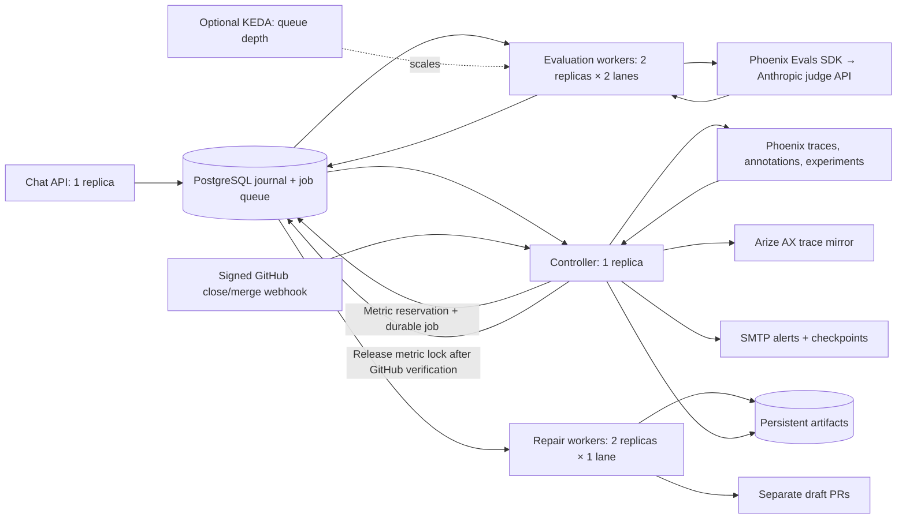

# Kubernetes deployment path

The local demo uses SQLite, a controller/evaluator process and two repair processes. The repository
also provides a container, a shared PostgreSQL backend, Kubernetes Deployments and
optional queue-based autoscaling. These are deployment assets, not a claim that a
cluster is running or that million-request throughput has been demonstrated.

## Why Kubernetes

Our work arrives continuously after chat turns. Kubernetes can run the existing
evaluation workers as replicas, restart failed processes and drain workers during
updates. Adding Airflow would introduce a scheduler, metadata database and DAGs
for work already represented by durable jobs. The
[Arize AX Airflow provider](https://arize.com/docs/ax/integrations/orchestration/airflow/airflow-provider)
is useful for AX batch orchestration; it is not required to execute Phoenix Evals.
The customer's explicit choice to add scalable orchestration is met here by Kubernetes.



Phoenix's server is the inspection and evidence workbench. The Python workers
execute Phoenix Evals; Claude runs remotely at Anthropic. Kubernetes does not host
the judge model and does not replace Phoenix.

## What is implemented

| Component | Behavior |
| --- | --- |
| `quality/postgres.py` | Shared journal, bound SQL parameters, pooled connections, atomic `FOR UPDATE SKIP LOCKED` job claims and commit-time push notifications. |
| `quality/worker.py` | Renewable leases, owner-checked acknowledgments, bounded retry and graceful process shutdown. |
| Evaluator Deployment | Two replicas, two concurrent evaluation jobs each. Optional KEDA scales from 1 to 10 replicas based on queued plus running evaluations. |
| Controller Deployment | One process owns exports, evaluation-event monitoring, notifications, shared baselines and checkpoints. |
| Repair Deployment | Two independent replicas. A database unique index reserves each metric through the entire PR-review interval. Different metrics execute concurrently. |
| API Deployment | One replica: conversation context is currently held in process memory. It is deliberately not autoscaled. |
| Deployment security | Non-root containers, read-only root filesystem, resource limits, no Kubernetes API token mounted, secrets supplied externally. |
| CI | Real PostgreSQL concurrency/recovery tests, immutable baseline checks, manifest rendering and an actual Linux image build/smoke test. |

Workers share PostgreSQL instead of mounting a SQLite file across pods.
`QUALITY_REQUIRE_POSTGRES=true` rejects a missing database URL. The SQL adapter is
limited to this application's internal statements, not arbitrary user SQL.

Delivery is **at least once**. Leases and stable job/annotation keys reduce duplicates,
but a process killed after an external model/SMTP call may replay that call.
Ownership checks protect acknowledgments; they do not make external calls exactly once.
Model work that exceeds its termination grace period may be reclaimed (600 seconds
for evaluation/controller, 7200 for repair pods).

Queue inserts commit before PostgreSQL sends `NOTIFY`; each consumer subscribes
before claiming jobs. The durable table is authoritative: notification loss or a
restart cannot delete work. A five-second transport timeout recovers retries and
expired leases; it does not rerun metric checks. Monitoring is triggered only by
evaluation/audit/PR lifecycle events. See PostgreSQL's
[transactional notification semantics](https://www.postgresql.org/docs/current/sql-notify.html)
and [Psycopg notification API](https://www.psycopg.org/psycopg3/docs/advanced/async.html#asynchronous-notifications).

## Deploy when a cluster is available

Prerequisites: a PostgreSQL database dedicated to this journal, a reachable Phoenix
instance, an image registry, a Kubernetes context and a storage class supporting
**ReadWriteMany**. Controller and repair pods mount the same artifact volume at
`/state`; each experiment/candidate has its own UUID directory. Configure the PVC's
storage class explicitly when the default does not support this
[access mode](https://kubernetes.io/docs/concepts/storage/persistent-volumes/#access-modes).
Phoenix can use its own PostgreSQL database through its official
[self-hosting deployment options](https://arize.com/docs/phoenix/self-hosting/deploying-phoenix).
Do not put the Phoenix and quality-journal schemas in the same database namespace.

1. Build and push the image using your registry. Pin the same image digest for the
   API, controller, evaluator and repair deployments in `deploy/kubernetes/kustomization.yaml`.
   Do not roll out mixed evaluator revisions against the same unpartitioned queue.

   ```sh
   docker build -t YOUR_REGISTRY/travel-quality:YOUR_VERSION .
   docker push YOUR_REGISTRY/travel-quality:YOUR_VERSION
   ```

2. Update `deploy/kubernetes/config.yaml`: Phoenix endpoint/project, GitHub
   repository, SMTP relay and recipient. The checked-in hostnames are placeholders.
   The image contains source, fixtures and dependencies; it contains no local
   credentials, database, traces or benchmark evidence.

3. Supply two Secrets through your organization's secret manager. For a private
   trial, create ignored local `.env.k8s-runtime` and `.env.k8s-controller` files:

   - Runtime: `QUALITY_DATABASE_URL` (include TLS settings for a remote database),
     `ANTHROPIC_API_KEY`, and `PHOENIX_API_KEY` if Phoenix authentication is enabled.
     Optional AX mirror: `ARIZE_SPACE_ID`, `ARIZE_API_KEY`, `ARIZE_OTLP_ENDPOINT`.
   - Controller: `GITHUB_TOKEN`, `QUALITY_SMTP_USERNAME`, `QUALITY_SMTP_PASSWORD`,
     optional `QUALITY_GITHUB_WEBHOOK_SECRET`. Scope GitHub credentials to this
     repository. Repair pods receive the GitHub key specifically, without SMTP
     secrets. The API receives only the optional webhook secret from this Secret.

   ```sh
   kubectl apply -f deploy/kubernetes/namespace.yaml
   kubectl -n agent-quality create secret generic quality-runtime --from-env-file=.env.k8s-runtime
   kubectl -n agent-quality create secret generic quality-controller-secrets --from-env-file=.env.k8s-controller
   kubectl apply -k deploy/kubernetes
   kubectl -n agent-quality rollout status deployment/quality-evaluators
   kubectl -n agent-quality rollout status deployment/quality-controller
   kubectl -n agent-quality rollout status deployment/quality-repairs
   kubectl -n agent-quality rollout status deployment/quality-api
   kubectl -n agent-quality port-forward service/quality-api 8000:8000
   ```

   Open `http://127.0.0.1:8000/dashboard`. The app keeps its loopback host/origin
   restrictions. Public ingress requires authentication and reviewed host/origin
   configuration; the manifests do not expose an unauthenticated public service.

   For production PR lifecycle delivery, route GitHub's `pull_request` webhook to
   `/quality/github/webhook` through a reviewed HTTPS ingress. Set its shared secret;
   the app verifies HMAC signatures, deduplicates delivery IDs and queries GitHub
   before releasing locks. Do not enable public ingress solely for this demo.
   `python -m scripts.demo sync-prs` confirms review outcomes locally instead.

4. For optional autoscaling, install KEDA in the cluster and allow its operator to
   query PostgreSQL, then use `kubectl apply -k deploy/kubernetes-autoscaling`.
   The PostgreSQL scaler counts pending and running evaluation jobs and suppresses
   growth during a recorded provider block. Tune its replica cap to the provider's
   actual request/token quotas. See the
   [official PostgreSQL scaler](https://keda.sh/docs/2.18/scalers/postgresql/).

5. A new database starts with no benchmark or enabled repair campaign. Measure a
   baseline through the existing workflow before proposing changes. This setup
   does not migrate local evidence automatically. Keep the original SQLite/Phoenix
   data and immutable baseline versions; migration needs a separately verified
   transfer of records, Phoenix identifiers and controller artifacts.

### Updates and recovery

Use a coordinated maintenance rollout for evaluator-code changes: stop new input,
scale API/controller/evaluators/repairs to zero, allow existing jobs to drain, update the
shared image digest, then reapply and resume. If KEDA is enabled, pause/remove the
ScaledObject before manually scaling evaluators. Recreate prevents old/new replicas
within one Deployment overlapping; it does not coordinate four Deployments.
Do not delete PostgreSQL or the artifact PVC during rollback. Restore the prior
image digest and review pending work before resuming. Back up the journal, Phoenix
database and artifact volume together; history in the old journal is not recreated
by launching an empty cluster.

Run isolated checks with `uv sync --locked --extra dev --extra production`, set
`TEST_POSTGRES_URL` to an expendable test database, then run
`uv run pytest -q tests/test_postgres.py`. Tests create separate temporary schemas
and delete only those schemas. They never call an LLM or write demo telemetry.

## Enterprise capacity: design versus proof

One million requests/day is about **11.6 requests/second on average**; peak rate
matters more. A worker lane handles one turn evaluation at a time. Approximate
required concurrent lanes are:

`peak evaluated turns/second × measured mean evaluation duration in seconds`

The current audited evaluator can make four judge calls per turn: three primary
metrics plus the retained completion diagnostic. At 100% coverage, one million
turns can mean roughly four million judge calls before retries. Adding pods cannot
overcome Anthropic request/token quotas. The supplied 1–10 replica limit is a
starting configuration, not a validated sizing recommendation.

For enterprise deployment, the remaining work is explicit:

- Measure sustained and burst load, evaluation queue age, export lag, provider
  rate limits, retries and score coverage before setting an SLO or replica cap.
- Add a shared provider budget/rate limiter. Use representative evaluation sampling
  if full coverage is impractical; report sampling and coverage rather than treating
  unevaluated requests as passes. Sampling is not implemented in this demo.
- Move chat sessions to shared storage before scaling the API. Partition queues,
  monitoring state and windows by agent/tenant/version before concurrent multi-agent use.
- Separate/batch trace exporters, use appropriate retention/indexes/partitions, and
  avoid full-history scans. The singleton controller and per-span export queue are
  known throughput limits. An OTLP collector or dedicated exporter fleet is a natural
  extension; it is not configured here.
- Size Phoenix's database/storage or use AX for the customer's target trace volume.
  The current PostgreSQL journal removes machine-local coordination, but does not
  establish that either database can handle the required workload.
- Add SSO/RBAC, tenant isolation, network policy, managed secrets, backups, retention,
  audited migrations and restore drills. Execute proposed code in isolated jobs with
  no publishing credentials; the demo subprocess validator is not an enterprise sandbox.

This is a concrete path for horizontal **evaluation and repair worker** scaling while preserving
the proof-of-concept scope. It is not yet a fully scalable enterprise serving platform.
