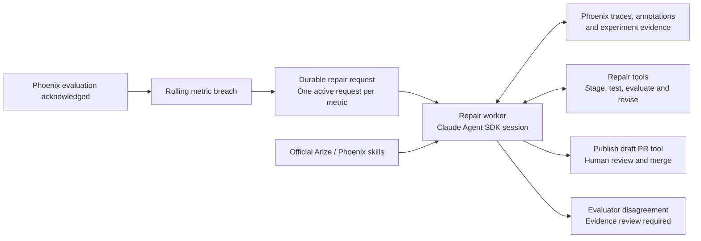

# Repair agent runtime and skills

Each metric investigation starts a fresh **Claude Agent SDK for Python** session
inside a repair worker. The SDK owns investigation, candidate edits, checks,
targeted evaluation, result inspection, bounded revisions and draft publication
through constrained tools. It starts its own bundled Claude process. The worker
is a durable session host, not a second repair agent. Concurrent workers have independent sessions, scratch
directories and candidates; the existing durable per-metric reservation remains
held while a PR awaits human review.

## Skills selected and when they run

The official documents are vendored, unmodified, under
`quality/skill_resources/`. The manifest pins upstream revisions and SHA-256
hashes; hashes are checked before staging and reading a document. Native SDK
`Skill` discovers the four skills; native `Read` loads their packaged references.
Loading a skill is recorded only after the SDK reports a successful invocation.
The SDK's discovery event may also list its bundled built-in skills; the explicit
session skill allowlist and hooks permit only the four selected skills.

| Skill | Trigger | What it contributes |
| --- | --- | --- |
| [phoenix-evals](../quality/skill_resources/phoenix-evals/SKILL.md) | Every failure investigation; validation reference on candidate revisions or judge disagreements | Evidence-first error analysis, deterministic facts versus judge opinions, and human calibration. |
| [phoenix-tracing](../quality/skill_resources/phoenix-tracing/SKILL.md) | Evidence contains tool calls | Follow agent/LLM/tool relationships to distinguish tool failures from unsupported answer claims. |
| [arize-prompt-optimization](../quality/skill_resources/arize-prompt-optimization/SKILL.md) | A proposal changes the system prompt | Apply the official optimization method to real failures; preserve working behavior and template variables; avoid memorizing incident examples. The official meta-prompt reference is also required. |
| [arize-experiment](../quality/skill_resources/arize-experiment/SKILL.md) | Revising a candidate or inspecting experiment evidence | Read actual results, distinguish examples from experiment runs, identify regressions, and qualify small samples. Prior candidate evidence requires successful experiment inspection. |

The SDK can select additional packaged references when relevant. It cannot submit
a candidate without the required guidance and a successful Phoenix trace read.
Tool-bearing evidence requires a tool-bearing trace read. Documentation loading
is auditable evidence of access, **not proof that the model reasoned correctly**.
Tests and human review still decide whether a proposed change is sound.

### Phoenix backend adaptation

The Arize skills describe AX CLI workflows. This application uses their portable
optimization and experiment-analysis guidance, with explicitly scoped **Phoenix
Python client tools exposed through SDK MCP** for actual execution:

- `inspect_phoenix_trace`: agent/LLM/tool spans plus separate automated and human
  annotations for supplied evidence runs.
- `inspect_phoenix_experiments`: actual experiment outputs and evaluation records
  matching the supplied development evidence. It does not reveal held-out rows or
  full benchmark aggregates to the repair model.
- `propose_patch`: stage a prompt and existing-function replacements; the session
  continues instead of stopping. Each revision has an immutable saved artifact.
- `get_repair_state`: resume from saved candidates and results after interruption.
- `run_candidate_checks`: execute fixed invariants and proposed-file regressions.
- `run_targeted_evaluation`: execute or resume one fixed Phoenix development
  experiment (up to 15 cases) for this candidate. Same-candidate retries reuse it.
- `publish_draft_pr`: publish only the exact checked/evaluated files, after the SDK
  has inspected Phoenix results and a current candidate trace. Requires hard gates,
  checks remote source changes and updates only this incident's open proposal.
- `finish_repair`: preserve an unresolved blocker for operator review; holds the
  metric reservation. A model stopping mid-loop is not reported as a completed fix.
- `report_evaluator_issue`: return an evidence-backed review request without
  editing the evaluator or overwriting its scores. This is agent feedback, not a
  human annotation.

Recorded review findings accompany candidate revisions even when their automated
labels pass. Their reviewer identity stays intact, and only development examples
from the relevant candidate experiment can be included.

This does **not** claim that AX CLI commands ran. The SDK chooses and invokes the
repair steps; deterministic tools enforce permissions and validation rules.
The evaluator workers still score actual executions, and the queue still provides
delivery, leases and per-metric reservations. They are services, not additional
repair agents. Skills cannot change the agreed baseline/checkpoint policy. Full
evaluation still runs manually or after both 24 hours and a version change.

### Why not install the entire catalog?

The other skills are useful for other responsibilities. AX administration,
provider credentials, compliance, migration, span routing and Prompt Hub
management do not diagnose the current incidents. Dataset and evaluator creation
belong to infrastructure setup and calibrated evaluation changes. Annotation
queues are valuable for future human review, but a repair agent should not write
its own opinions as human labels. Instrumentation health is useful for a separate
telemetry audit; this task does not grant the repair agent instrumentation edits.

## Runtime boundaries and deployment

- Native tools: `Skill` and `Read`, confined by hooks to verified skill documents.
  MCP tools cover scoped evidence, bounded candidates, fixed validation and draft publication. No shell,
  arbitrary file editing, evaluator mutation or merge tool is exposed.
- Each session has a temporary repository/workspace and home. User/global settings
  and unrelated MCP servers are not loaded. Session transcript persistence is
  disabled. Only the provider key and required OS environment values are passed
  to the Claude process; GitHub/AX/database credentials remain in the worker.
- The worker redacts input, tool output, persisted artifacts and exported spans.
  Native skill reads, Phoenix queries and actual SDK LLM stream events become
  OpenInference spans. Token usage and estimated session cost come from SDK
  messages; missing values are not synthesized. Thinking content is not exported.
- Limits: 48 SDK turns, 72 tool attempts, a $3 SDK budget estimate and three staged
  candidate revisions per repair record. The full-loop deadline is 90 minutes to
  accommodate the existing benchmark/evaluation timeout; investigation-only
  diagnostics retain ten minutes. Experiment model costs are separate from the SDK
  budget, bounded by the fixed case/revision limits. No full benchmark tool is exposed.
- Tool calls within a session are serialized so a concurrent edit cannot race a
  validation or publication. Different metric sessions remain independent.
- Every candidate's checks, experiment ID and outcome are persisted. Restarting
  reuses completed experiments, requires fresh Phoenix inspection and retains
  revision limits. Configuration changes and artifact tampering block publication.
  Completed cases resume after a crash; provider calls interrupted before their
  result is durably recorded can still repeat under at-least-once delivery.
- SDK hooks are application permissions, **not an OS sandbox**. Production repair
  workers run in separate non-root Kubernetes pods with a read-only root filesystem
  and writable `/tmp`; per-session files stay there. Local development uses
  separate worker processes. Stronger tenant/network isolation needs deployment
  policy and testing; no million-request capacity claim is made.

Core implementation: `quality/repair_runtime.py` (SDK session),
`quality/repair_skills.py` (pinned documents and Phoenix tools), and
`quality/repair_tools.py` (durable workflow tools and gates), and
`quality/remediation.py` (baseline/evidence setup and GitHub adapter).

## Verification

`tests/test_repair_skills.py` covers conditional skill use, document integrity,
scoped/redacted reads, separate annotation provenance, denied capabilities,
proposal gates, evaluator-review outcomes and tool budgets. Unit fixtures are
isolated from production telemetry. `tests/test_sdk_repair_loop.py` exercises
same-session revisions and publication, restart reuse, revision bounds, artifact
identity, held-out exclusion and independent metric workspaces. These scripted
unit checks are not evidence of live model reasoning. A separate paid SDK verification uses existing
real incident/candidate records and saves its audit under the ignored
`.quality/skill-runtime-verification/` directory. It neither merges a candidate
nor creates a duplicate PR for an already reserved metric.

On September 16, 2026, the real verification session
`9be74630-82c8-4694-83a6-6850d303003e` invoked all four skills, read the original
flight-failure trace and prior candidate trace, and retrieved that candidate's
actual Phoenix experiment evaluations. The resulting Phoenix trace is
`2824eedae48275757b24e570dcef664e`. A premature proposal was rejected until the
experiment read completed. The agent then acknowledged the recorded reviewer
disagreement despite the passing judge label and proposed a stronger prompt.
That candidate is saved for inspection only: this verification demonstrates the
runtime and tool use, not a measured improvement or a new approved deployment.

The assessment PDF requires development-time Arize/Phoenix skill or CLI use. This
runtime integration goes further at the customer's explicit request; it is not
presented as a separate requirement written into the PDF.

The later [operator-triggered PR #3 replay](sdk-pr3-replay.md) exercised fresh SDK
investigations, actual targeted experiments and a replacement PR proposal. That
record distinguishes the SDK's activity from the remaining agent and evaluator
quality limitations; it does not claim a new automatic live escalation.
